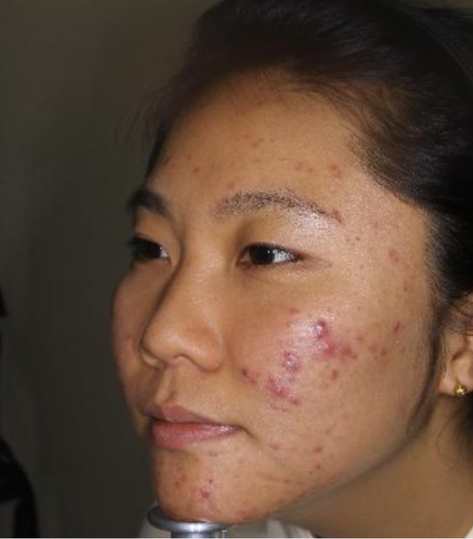

# Elective04 — Automated Image Processing with CI (GitHub Actions)

A Python-based project for automated image processing and analysis using modular computer vision techniques. The system reads images from an `input/` folder, applies selected processing modules, and writes the results to an `output/` folder—no manual configuration required.

This repository also demonstrates good engineering practices including unit testing with `pytest` and a Continuous Integration (CI) pipeline powered by GitHub Actions.

---

---

## Features / Modules

- **Acne Detection** — Detects and enhances acne-like features in facial images.
- **Crack Detection** — Identifies and highlights crack patterns in structural/surface images.
- **Dawn Enhancement** — Applies edge detection and enhancement for improved visual clarity.
- **Jigsaw Effect** — Produces a creative jigsaw-style transformation.

Each module:
- Automatically reads images from `input/`
- Saves processed outputs to `output/`


---

## Sample Images

Add your sample images to `docs/images/` and the README will render them automatically on GitHub.

Recommended file names (you can change them—just update the paths below):
- `docs/images/acne_input.jpg`, `docs/images/acne_output.jpg`
- `docs/images/crack_input.jpg`, `docs/images/crack_output.jpg`
- `docs/images/dawn_input.jpg`, `docs/images/dawn_output.jpg`
- `docs/images/jigsaw_input.jpg`, `docs/images/jigsaw_output.jpg`

### Acne Detection (Example)

| Input | Output |
| --- | --- |
|  |  |

### Crack Detection (Example)

| Input | Output |
| --- | --- |
|  |  |

### Dawn Enhancement (Example)

| Input | Output |
| --- | --- |
|  |  |

### Jigsaw Effect (Example)

| Input | Output |
| --- | --- |
|  |  |


---

## Project Structure

```
Elective04/
├── image_processing/           # Image processing modules
│   ├── acne_detector.py
│   ├── crack_detector.py
│   ├── dawn.py
│   └── jigsaw.py
├── input/                     # Place raw images here
├── output/                    # Processed images are saved here
├── tests/                     # Pytest unit tests
└── .github/workflows/         # GitHub Actions CI workflow(s)
    └── ci.yml
```

---

## Requirements

- **Python 3.9+**
- **pip**
- **Git**

Tip: Using a virtual environment is strongly recommended.

---

## Installation & Setup

### 1) Clone the repository

```bash
git clone https://github.com/<your-username>/Elective04.git
cd Elective04-main
```

### 2) Create and activate a virtual environment

Windows
```bash
python -m venv venv
venv\Scripts\activate
```

Mac/Linux
```bash
python -m venv venv
source venv/bin/activate
```

### 3) Install dependencies

```bash
pip install -r requirements.txt
```

---

## Running the Modules

Run any module directly:

```bash
python image_processing/acne_detector.py
python image_processing/crack_detector.py
python image_processing/dawn.py
python image_processing/jigsaw.py
```

Processed images will appear in:

```
output/
```

---

## Testing

This project uses **pytest** and includes unit tests for each module.

Run tests locally:

```bash
pytest
```

Tests focus on verifying:
- Successful execution of each module
- Output generation in `output/`

---

## Continuous Integration (GitHub Actions)

A GitHub Actions workflow automatically runs on:
- Every push
- Every pull request

Typical pipeline steps include:
1. Set up Python
2. Install dependencies from `requirements.txt`
3. Install/enable `pytest`
4. Run unit tests
5. Fail the build if any tests fail

Workflow file location:

```
.github/workflows/ci.yml
```

---

## Contributing

### Development Setup

1. Fork the repository
2. Clone your fork:
   ```bash
   git clone https://github.com/<your-username>/Elective04.git
   cd Elective04-main
   ```
3. Create and activate a virtual environment (see steps above)
4. Install dependencies:
   ```bash
   pip install -r requirements.txt
   pip install pytest
   ```

### Suggested Git Workflow

- Create feature branches (e.g., `feature/<name>`)
- Open Pull Requests for review before merging
- Use consistent commit message prefixes such as:
  - `feat:` add a feature
  - `test:` add or update tests
  - `fix:` bug fixes
  - `ci:` CI/workflow changes
  - `docs:` documentation updates

Example:

```bash
git add .
git commit -m "feat: add acne detection improvements"
git push origin feature/acne-improvements
```

---

## Team Notes (Optional)

This project supports structured collaboration where team members contribute across:
- Development
- Testing
- CI configuration
- Documentation

---

## License

Add your chosen license here (e.g., MIT, Apache-2.0), or include a `LICENSE` file.

---

## Notes

- Ensure the `input/` folder contains supported image formats before running modules.
- If you add new modules, include:
  - A script in `image_processing/`
  - A corresponding test in `tests/`
  - Any dependency updates in `requirements.txt`
 
  # Authors

Mangahas, Romualdo Jr. N.  — **Programmer**
****

Lorenzo, Aeron Abigail R.  — **DevOps**
**  **

Verueco, Joemar A.  — **QA**
** **

Correa, Reingel F.  — **Presenter**
** **
